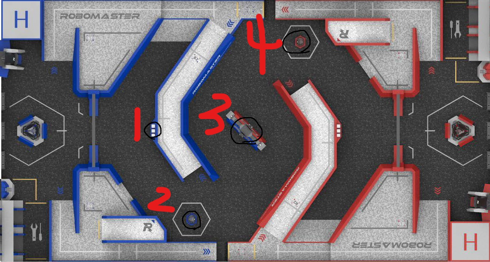

Robomaster2023 CSU FYT Radar 

# 前提

本程序使用大恒工业相机，模型使用自己训练的`YOLOv7`，未开源，可使用自己的`.pt`权重文件

# 文件结构

+ models 存储`yolov7 backbone`
+ Serial 串口部分
+ sources 资源文件
+ DahengSDK 大恒相机驱动
+ yolov7 目标检测
+ adjustAngle.py 仿射变换
+ mainApp.py 主程序

# 使用

## 定义仿射变换矩阵

`python adjustAngle.py --stream `

```
 参数说明：
 stream -str 指定读取视频/相机，相机使用"Daheng"，视频使用"路径名"
```

>若stream参数选用Daheng

根据程序运行出现的相机窗口进行相机角度的调整，同时键入`R`键可进行仿射变换矩阵的计算

总计四个点，将相机中实际点按下图从左至右的顺序进行标点，若标注不准确可任意点满四点等标定窗口关闭后再按`R`键进行重新标点



若相机视角调整完毕并且标定完毕，`ESC`退出即可，准备运行下一步程序

> 调整曝光时间

每次需手动设置曝光时间，暂不支持命令行设置，设置位于`DahengSDK/utils.py`下17行，更改函数`ExposureTime.set()`中的值即可

## 运行主程序

`python mainApp.py --stream --weight --map --ser`

---

> ` eg: python mainApp.py --stream Daheng --ser COM5 --map sources/blueMap.png`

```
stream 同上一程序
weight -str 可选声明，权重文件的位置，默认为根目录下'radar.pt'
map -str 可选声明，己方为红方即使用"sources/redMap.png"，默认为sources文件夹下蓝方地图"blueMap.png"
ser -str 串口号，windows下一般为"COM5"/"COM6"
```

> DEBUG

调试每一帧 detect.py注释掉CHECK EVERY FRAME

检测之后在新窗口中绘图 detect.py注释掉 DEBUG plot on the...

显示原窗口 mainApp.py 注释掉 DEBUG tag1

显示己方地图 mainApp.py 注释掉 DEBUG plot


---

**特别感谢 [上海交通大学雷达站开源](https://github.com/COMoER/LCR_sjtu)**
